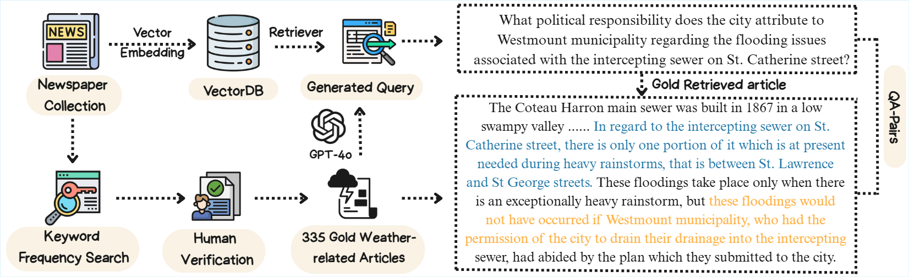
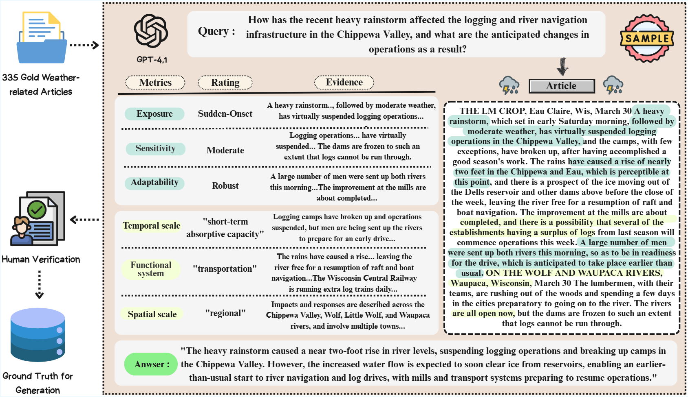

# WeatherArchive-Bench: Benchmarking Retrieval-Augmented Reasoning for Historical Weather Archives

<p align="center">
<a href='https://arxiv.org/html/2510.05336'></a>
<a href='https://github.com/Michaelyya/WeatherArchive-Bench'></a>
<a href="https://opensource.org/licenses/MIT" target="_blank"></a>
<a href='https://huggingface.co/datasets/WxChat/WeatherArchiveBench' target="_blank">
  
</a>
</p>

This repository contains constructed datasets and evaluation frameworks for WeatherArchive-Bench (SIGIR 2026). It comprises two tasks: **WeatherArchive-Retrieval**, which measures a system’s ability to locate historically relevant passages from over one million archival news segments, and **WeatherArchive-Assessment**, which evaluates whether Large Language Models (LLMs) can classify societal vulnerability and resilience indicators from extreme weather narratives.

## 📁 Project Structure

```
WeatherArchive-Bench/
├── 📁 data/                              # Benchmark datasets (see data/README.md)
│   ├── QACandidate_Pool.csv              # 335 queries × 100 candidate passages
│   ├── QACorrect_Passages.csv            # 335 gold query-passage pairs
│   ├── ground_truth_climate.csv          # Expert-annotated IPCC classification labels
│   ├── output-top3.csv                   # Top-3 retrieved passages (default model)
│   ├── output-top3_ANCE.csv              # Top-3 retrieved passages (ANCE)
│   ├── output-top3_Gemini.csv            # Top-3 retrieved passages (Gemini)
│   └── README.md                         # Dataset documentation and example usage
│
├── 📁 constant/                          # Configuration and constants
│   ├── climate_framework.py              # IPCC vulnerability framework prompts
│   └── constants.py                      # File paths and model configurations
│
├── 📁 WeatherArchive_Retrieval/          # Retrieval evaluation framework
│   ├── qa_pair/                          # Retrieval input data
│   │   ├── queries.csv                   # Query set
│   │   ├── correct_passages.csv          # Ground truth passages
│   │   └── concatenated_chunks.csv       # Full corpus (1M+ passages, Git LFS)
│   ├── output/                           # Retrieval results per model
│   │   ├── overall.csv                   # Aggregated metrics across all models
│   │   └── raw_*.csv                     # Per-model top-100 retrieval results
│   ├── retriever_eval_1.py               # BM25 + cross-encoder reranking
│   ├── retriever_eval_2.py               # SBERT, SPLADE
│   ├── retriever_eval_3.py               # ANCE, UniCoil
│   ├── retriever_eval_4.py               # Qwen embeddings
│   ├── retriever_eval_5.py               # OpenAI embeddings
│   ├── retriever_eval_6.py               # Arctic, Granite embeddings
│   ├── retriever_eval_7.py               # Gemini embeddings
│   ├── overall.py                        # Aggregate evaluation metrics
│   ├── utils.py                          # Evaluation utilities
│   └── README.md                         # Retrieval framework documentation
│
├── 📁 WeatherArchive_Retrieval_pyserini/ # Pyserini reimplementation of Retrieval
│   ├── retriever_eval_1.py … _7.py       # Same 7 retrievers, routed through Pyserini
│   ├── pyserini_utils.py                 # Index/encode/search helpers (Lucene + FAISS + impact)
│   ├── overall.py / utils.py             # Same metrics + parity shim
│   └── README.md                         # Pyserini module documentation
│
└── 📁 WeatherArchive_Assessment/         # Climate impact assessment framework
    └── src/
        ├── climate_eval.py               # IPCC vulnerability classification
        ├── rag_eval.py                   # RAG-based QA (with retrieved passages)
        ├── rag_eval_gold.py              # RAG-based QA (with gold passages)
        ├── rag_eval_two_experiments.py   # Additional RAG experiments
        ├── classification_metrics.py     # Classification evaluation metrics
        └── QA_metrics.py                 # QA evaluation metrics (BLEU, ROUGE, BERTScore)
```

## 📦 Datasets

The benchmark is built on 335 expert-curated queries about extreme weather events drawn from historical newspaper archives (19th--early 20th century). Each query has a single gold-standard passage and expert-annotated vulnerability/resilience labels.

**For detailed file schemas, task-to-dataset mappings, and example loading scripts, see [`data/README.md`](data/README.md).**

| Dataset | File | Description |
|---------|------|-------------|
| Query-Passage Pairs | `data/QACorrect_Passages.csv` | 335 gold query-passage pairs |
| Candidate Pool | `data/QACandidate_Pool.csv` | 100 candidate passages per query for reranking |
| Classification Labels | `data/ground_truth_climate.csv` | Expert annotations across 6 IPCC-aligned dimensions |
| Retrieved Passages | `data/output-top3*.csv` | Top-3 passages from different retrieval models |
| Full Corpus | `WeatherArchive_Retrieval/qa_pair/concatenated_chunks.csv` | 1M+ archival news segments (Git LFS) |

The datasets are also available on [HuggingFace](https://huggingface.co/datasets/WxChat/WeatherArchiveBench).

> **Note on source data:** The passages originate from digitized historical newspaper collections and have been processed through OCR. Due to intellectual property restrictions, the raw scanned newspaper pages and original OCR output cannot be redistributed. The CSV files in this repository contain **post-OCR-corrected text** that has been cleaned for retrieval and language model evaluation. Source provenance (city, date, publication context) is embedded within the passage text itself. See [`data/README.md`](data/README.md) for details.

## 🔬 Experiments and Evaluation

### WeatherArchive-Retrieval

<div align="center">
    
</div>

**Objective**: Evaluate how well retrieval models can locate the correct historical passage from a corpus of 1M+ archival news segments, given a weather-related query.

**Data flow**: `queries.csv` + `concatenated_chunks.csv` --> retrieval model --> `output/raw_*.csv` --> evaluated against `correct_passages.csv` using Recall@k, nDCG@k, MRR@k, and BLEU@1.

We benchmark 13+ retrieval models spanning sparse (BM25 variants), dense (SBERT, SPLADE, ANCE, UniCoil), and API-based (OpenAI, Gemini, Qwen, Arctic, Granite) approaches, with optional cross-encoder reranking.

### WeatherArchive-Assessment

<div align="center">
    
</div>

**Objective**: Evaluate LLM performance on two downstream tasks that require understanding extreme weather narratives.

**Sub-task 1 -- Vulnerability/Resilience Classification**: Given a query and its correct passage, the LLM classifies the event along six IPCC-aligned dimensions (Exposure, Sensitivity, Adaptability, Temporal scale, Functional system, Spatial scale). Model predictions are evaluated against expert annotations in `ground_truth_climate.csv` using accuracy, F1, precision, and recall.

**Sub-task 2 -- Free-form Question Answering (RAG)**: Given a query and retrieved passage(s), the LLM generates a free-form answer. Answers are evaluated using BLEU, ROUGE-1, ROUGE-L, and BERTScore against GPT-4.1 oracle answers. This sub-task tests both with retrieved passages (`output-top3*.csv`) and gold passages (`QACorrect_Passages.csv`) to measure the impact of retrieval quality on downstream QA.

We evaluate 17 LLMs including GPT-3.5/4o/4.1, Llama-3, Qwen-2.5/3, Mistral/Mixtral, DeepSeek-V3, Claude, and Gemini.


## 📊 Key Results Summary

### Retrieval Performance Highlights

| Model                    | Recall@100 | nDCG@100  | MRR@100   | BLEU@1    |
| ------------------------ | ---------- | --------- | --------- | --------- |
| **Gemini Embedding 001** | **95.8%**  | **58.8%** | **48.7%** | **51.7%** |
| Arctic Embed 2.0         | 91.0%      | 54.2%     | 44.5%     | 44.2%     |
| BM25Okapi + CE           | 83.0%      | 52.5%     | 44.0%     | 56.5%     |
| OpenAI-3-large           | 89.6%      | 57.1%     | 47.1%     | 50.2%     |
| ANCE                     | 86.6%      | 40.8%     | 29.3%     | 27.6%     |


## 🚀 Getting Started

### Prerequisites

```bash
pip install -r requirements.txt
cp .env.example .env  # Then fill in your API keys
```

### Quick Start: Loading the Data

```python
import pandas as pd

# Load gold query-passage pairs
correct = pd.read_csv("data/QACorrect_Passages.csv")
print(f"{len(correct)} queries with gold passages")

# Load classification ground truth
gt = pd.read_csv("data/ground_truth_climate.csv")
print(f"Classification labels: {['exposure', 'sensitivity', 'adaptability', 'temporal', 'functional', 'spatial']}")

# Load candidate pool (100 passages per query)
pool = pd.read_csv("data/QACandidate_Pool.csv")
row = pool.iloc[0]
correct_passage = row[f"passage_{int(row['correct_passage_index'])}"]

# Load retrieved passages for RAG
top3 = pd.read_csv("data/output-top3_Gemini.csv")
context = "\n\n".join([top3.iloc[0]["top_1_text"], top3.iloc[0]["top_2_text"], top3.iloc[0]["top_3_text"]])
```

See [`data/README.md`](data/README.md) for more detailed examples.

### Running WeatherArchive-Retrieval

```bash
# BM25 variants with cross-encoder reranking
python -m WeatherArchive_Retrieval.retriever_eval_1

# Dense retrieval models
python -m WeatherArchive_Retrieval.retriever_eval_2  # SBERT, SPLADE
python -m WeatherArchive_Retrieval.retriever_eval_3  # ANCE, UniCoil
python -m WeatherArchive_Retrieval.retriever_eval_4  # Qwen models
python -m WeatherArchive_Retrieval.retriever_eval_5  # OpenAI models (requires OPENAI_API_KEY)
python -m WeatherArchive_Retrieval.retriever_eval_6  # Arctic, Granite
python -m WeatherArchive_Retrieval.retriever_eval_7  # Gemini models (requires GOOGLE_API_KEY)

# Aggregate metrics across all models
python -m WeatherArchive_Retrieval.overall
```

**Pyserini variant.** `WeatherArchive_Retrieval_pyserini/` reproduces the same seven retrievers and metrics through Pyserini's Lucene / FAISS / impact searchers, with identical inputs and `raw_*.csv` outputs. BM25 is hybrid (Pyserini Lucene Okapi BM25, with `rank_bm25` kept for the BM25Plus/BM25L variants Lucene can't reproduce), and SPLADE/uniCOIL use Pyserini's learned-sparse impact pipeline. It additionally needs a JVM (JDK 11+) for Lucene. Run the same way and aggregate with `overall.py`:

```bash
python -m WeatherArchive_Retrieval_pyserini.retriever_eval_1   # … through _7
python -m WeatherArchive_Retrieval_pyserini.overall
```

See [`WeatherArchive_Retrieval_pyserini/README.md`](WeatherArchive_Retrieval_pyserini/README.md) for the full model→component mapping.

### Running WeatherArchive-Assessment

```bash
# Sub-task 1: Vulnerability/Resilience Classification
python -m WeatherArchive_Assessment.src.climate_eval          # Run LLM classification
python -m WeatherArchive_Assessment.src.classification_metrics # Evaluate against ground truth

# Sub-task 2: Free-form Question Answering (RAG)
python -m WeatherArchive_Assessment.src.rag_eval              # Run RAG with retrieved passages
python -m WeatherArchive_Assessment.src.rag_eval_gold         # Run RAG with gold passages
python -m WeatherArchive_Assessment.src.QA_metrics            # Evaluate QA outputs
```

## 🔧 Configuration

- **Model selection**: Edit `constant/constants.py` to choose which LLMs to evaluate (supports OpenAI, HuggingFace, DeepSeek/Claude/Gemini via API).
- **IPCC prompts**: The classification and RAG prompts are defined in `constant/climate_framework.py`.
- **API keys**: Set `OPENAI_API_KEY`, `GOOGLE_API_KEY`, and `HUGGINGFACE_API_KEY` in your `.env` file (see `.env.example`).


---

_This repository contains the complete implementation and evaluation framework for WeatherArchive-Bench_
